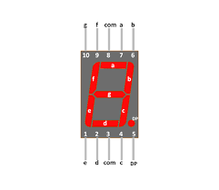

# Arduino Advanced Seven Segment library
this library created for user friendly access to seven segment



Installing this Library
=====

1. Download this library by clicking download zip at the top right of this repository or cloning the repository to your computer.

2. In the arduino IDE: Sketch -> Include Library -> Add .ZIP library : and go to where the zip file you downloaded is located. Done!

3. When you want to use this library, just include the library @ Sketch -> Include Library in the Arduino IDE and you are good to go!

How to use this library
=====

**How to show number value**
```C
/*value should be between [0 - 9]*/
sevenSegment.setNumber(i);
```

**How to show specific characters**
```C
/*value should be between ['a', 'b', 'c', 'd', 'e', 'f', 'h', 'l', 'p', 'q', 'u', 'y']*/
sevenSegment.setCharacter(c);
```
**How to clean value**
```C
sevenSegment.clean();
```

**How to refresh display**
```C
sevenSegment.refresh();
```
**How to set value manually**
```C
/*for examples set value "2" by manually*/
sevenSegment.print(1, 1, 0, 1, 1, 0, 1);  
```
**show dot/dash**
```C
sevenSegment.setDot(state); // state : [1 ,0] 
sevenSegment.setDash(); // show center dash
```

LICENSE
=====

```
The MIT License (MIT)

Copyright (c) 2020 Mohamad Hoseini


Permission is hereby granted, free of charge, to any person obtaining a copy of this software and associated documentation files (the "Software"), to deal in the Software without restriction, including without limitation the rights to use, copy, modify, merge, publish, distribute, sublicense, and/or sell copies of the Software, and to permit persons to whom the Software is furnished to do so, subject to the following conditions:

The above copyright notice and this permission notice shall be included in all copies or substantial portions of the Software.

THE SOFTWARE IS PROVIDED "AS IS", WITHOUT WARRANTY OF ANY KIND, EXPRESS OR IMPLIED, INCLUDING BUT NOT LIMITED TO THE WARRANTIES OF MERCHANTABILITY, FITNESS FOR A PARTICULAR PURPOSE AND NONINFRINGEMENT. IN NO EVENT SHALL THE AUTHORS OR COPYRIGHT HOLDERS BE LIABLE FOR ANY CLAIM, DAMAGES OR OTHER LIABILITY, WHETHER IN AN ACTION OF CONTRACT, TORT OR OTHERWISE, ARISING FROM, OUT OF OR IN CONNECTION WITH THE SOFTWARE OR THE USE OR OTHER DEALINGS IN THE SOFTWARE.
```